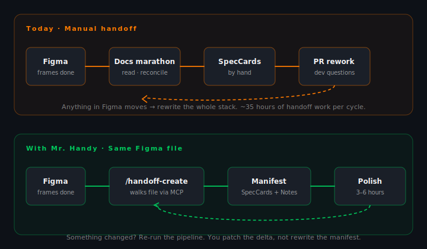

# Mr. Handy

> **Design handoff documentation specialist** for Cursor, Claude Code, Codex, Windsurf, Zed, Cline, and Continue. Turns the finished Figma file into a structured manifest your dev team can read.

<p align="center">
  
</p>

---

## What it is — in 30 seconds

Mr. Handy walks your finished Figma file and produces the **documentation manifest your dev team would otherwise build by hand**: per-screen SpecCards, cross-screen business rules, a Scenario Coverage Matrix, token references, accessibility notes, and an Apple-keynote-style SlideV deck if you want one.

It does not design. It does not write code. It **reads Figma like a senior designer, writes the docs the way a senior designer would**, and turns "one small change" into "re-run the pipeline and patch the delta" — instead of a four-hour rewrite.

White-label by design: project name, brand, design system, Figma library key, font family, and deck palette are all read from `mr-handy.config.json` at runtime. **Any company, any design system, one config swap.**

---

## The workflow — before and after



The top track is what happens today after screens ship in Figma. The bottom track is what Mr. Handy does from the same file. The only difference is the loop at the end: **one full rewrite, or a 5-minute delta run**.

---

## What it produces

| Output | File | When to use |
|---|---|---|
| **Per-screen handoff** | `Handoff-{Flow}.md` + `Handoff-{Flow}.html` + `screenshots/*.png` | Default. Drop into the project repo, link from the PR, hand to new devs. |
| **Figma canvas handoff** | New page with SpecCards and Notes placed beside the frames | When the team lives in Figma and wants the docs there. |
| **Per-component spec** | `components/{slug}.md` (anatomy + API + color + structure + a11y) | When a single component needs to be the source of truth (design system work, library publishing). |
| **SlideV deck** | `presentations/{slug}/slides.md` + `style.css` + PDF/PPTX export | When the handoff needs to land in front of stakeholders, not just devs. |

---

## The tool stack

Nothing exotic. The same four tools the modern design-dev handoff already runs on.

| | | |
|---|---|---|
|  | **Cursor** | IDE + agent host |
|  | **Claude** | Reasoning model |
|  | **Figma + MCP** | Source of truth |
|  | **Markdown / HTML** | Handoff output |

---

## Three tracks, one specialist

### 1. Per-screen handoff

Multi-screen flows, dashboards, wizards, kanban boards, full pages. Mr. Handy walks each screen, builds a Scenario Coverage Matrix, annotates SpecCards (the canonical handoff card layout — five fields: Name, Value, Behavior, Description, States), generates a Notes section for cross-screen rules, and produces:


- **Mode A** — `Handoff-{Flow}.md` + `Handoff-{Flow}.html` + `screenshots/{kebab-case-screen}.png`
- **Mode B** — a Figma canvas page with SpecCards and Notes, plus a companion Markdown table


The Notes section consolidates cross-screen rules — thresholds, role permissions, status mappings, business logic. Tables for thresholds; ≤6 bullets per note; no four-deep bullet trees.


Every screen passes through the same processing loop: **REASON → PLAN → GATHER + EXECUTE → CONTINUE**. Three or more screens get fanned out across parallel `mr-handy-screen-analyzer` subagents. Conflict between sources (Figma vs Jira vs spec markdown) is surfaced explicitly — Mr. Handy never silently picks a side.

```
/handoff-create   → new flow from a Figma URL
/handoff-update   → refresh an existing handoff after design changes
/handoff-compare  → diff two versions and surface drift
```

### 2. Per-component specs (uSpec)

A single component, fully specified. Anatomy markers, the variant property matrix, the typed API, color tokens per layer, exact structural dimensions per size/density variant, screen-reader focus order across VoiceOver / TalkBack / ARIA, and motion timelines. The output is a single self-contained `components/{slug}.md` you can hand to any LLM — or a set of native Figma annotation frames placed next to the component if you prefer the canvas path.

The per-component pipeline runs the vendored uSpec extractor (a small Figma plugin) inside the Figma sandbox to produce a `_base.json` Ajv-validated payload, then orchestrates four interpretation specialists (`extract-api`, `extract-structure`, `extract-color`, `extract-voice`) and reconciles their outputs before rendering.

```
/handoff-component  → spec a single component end-to-end
```

### 3. SlideV executive decks

Turn a completed per-screen handoff into an Apple-keynote-style SlideV deck. The deck creator extracts the story arc, coverage stats, and screenshots from `Handoff-{Flow}.md`, then emits a ready-to-export `presentations/{slug}/` package.


```
/handoff-deck  → generate a SlideV deck from a handoff
```

See [`slidev-decks.md`](./slidev-decks.md) for how the template works and how to brand it.

---

## FAQ — common questions

### How is the setup?

One command. The wizard (`Setup-MrHandy.bat` on Windows, `./setup-mrhandy.sh` on macOS / Linux / WSL, or `node setup-mrhandy.mjs` directly) verifies Node ≥ 18, populates `mr-handy.config.json`, asks one y/N question for the optional Atlassian MCP, writes the right `mcp.json` for every IDE it finds installed, and builds the uSpec extractor. Figma and Atlassian use OAuth — no PAT, no email, no API token. **By default the wizard runs silently** — no readline prompts, placeholders are valid, idempotent re-runs. After that, restart your IDE, sign in to Figma (and Atlassian) in the browser when the OAuth pop-up appears, and the rules and skills auto-load.


Want the interactive wizard instead? `SETUP_INTERACTIVE=1 Setup-MrHandy.bat` (or `node setup-mrhandy.mjs` with no flags).

### Can I use this for my company?

**Yes.** Mr. Handy is white-label by design. Every brand binding is in `mr-handy.config.json`:

```json
{
  "project":        { "name": "Your Project", "brand": "Your Brand" },
  "designSystem":   { "name": "carbon | fluent-2 | material | apple-hig | custom" },
  "figmaTemplate":  { "fileKey": "YOUR_FILE_KEY" },
  "presentation":   { "brandPalette": { "background": "...", "accent": "..." } }
}
```

Adjusting for a new company is a config swap, not a code change. Run the wizard again with the new values and Mr. Handy rewrites the relevant parts only.

### What are the premises?

Four things, all of which most modern design teams already have:

- **Figma** is your design source-of-truth.
- **Cursor** (recent version), **Claude Code / Codex**, **Windsurf**, **Zed**, **Cline**, or **Continue** as the agent host.
- A **Figma account** (and optionally an **Atlassian account**) — both use OAuth; the browser opens on first use, you click Allow, tokens are cached.
- **Figma Desktop** installed (the uSpec plugin is desktop-only) and **Node.js ≥ 18** for the uSpec extractor, the SlideV exporter, and the setup wizard.

If you have those four, you have what you need.

### How do I adjust it for my company?

Four steps:

1. Run the wizard (`Setup-MrHandy.bat` on Windows, `./setup-mrhandy.sh` elsewhere) and answer with the new project name, brand, design system, Figma library key, font family, and brand palette.
2. Replace `designSystem.figmaLibraryKey` with the new library's file key.
3. Re-run the wizard with `--force` so the new library key lands in every per-IDE mcp.json.
4. Sign in to Figma (OAuth) once in the new environment.

That's it. No code, no rebuild, no re-install.

---

## Where to go next

| | |
|---|---|
| **New here?** | → [`getting-started.md`](./getting-started.md) |
| **Want to know how the system works internally?** | → [`how-it-works.md`](./how-it-works.md) |
| **Specifying a single component?** | → [`specs/component-md.md`](./specs/component-md.md) |
| **Building a SlideV deck?** | → [`slidev-decks.md`](./slidev-decks.md) |
| **Something broke?** | → [`help/troubleshooting.md`](./help/troubleshooting.md) |

---

## What's in the box

```
.cursor/rules/        ← always-on rules (core, output, deck, delegation, design-system, mcp, uspec, humanizer, …) — 13 files
.cursor/agents/       ← orchestrators (screen-analyzer, figma-builder, doc-generator, scenario-auditor, atlassian-explorer, component-orchestrator, deck-creator, self-auditor) — 8 files
.cursor/skills/       ← mr-handy-handoff thin orchestrator + vendored uSpec skill set
.claude/              ← Claude Code MCP wiring (gitignored after population)
.codex/                ← Codex MCP wiring (gitignored after population)
.windsurf/             ← Windsurf MCP wiring (gitignored after population)
.zed/                  ← Zed `settings.json` with `context_servers` (gitignored)
.cline/                ← Cline MCP wiring (gitignored after population)
.continue/             ← Continue MCP wiring (gitignored after population)
skills/               ← portable Codex / Claude Code skill (native orchestrator + references)
templates/            ← reusable starter kits (slidev-apple-keynote) + per-IDE mcp.json templates
Commands/             ← /handoff-create, /handoff-update, /handoff-compare, /handoff-component, /handoff-deck, /handoff-self-audit, the engine — 7 files
Knowledge/            ← knowledge files Mr. Handy reads at runtime
  design-systems/     ← per-DS reference docs (Fluent 2, Carbon, Material, Apple HIG, plus a _template.md)
  design-md/          ← public competitor design references (Stripe, Apple, Linear, …)
  scenario-coverage.md, annotation-patterns.md, html-template.md, …
references/           ← shared instruction files used by the per-component path
figma-plugin/         ← uSpec extractor (build with npm install && npm run build)
scripts/
  build-zip.cjs       ← zip-pack the repo for sharing (excludes .env, .cursor/mcp.json, etc.)
  capture-screenshots.mjs ← maintainer tool — re-runs auto-setup and refreshes the PNGs in this folder
docs/                 ← this folder
mr-handy.config.json  ← project, brand, design system, library key, font family, deck palette
.env.example          ← documented example of the .env shape and the env precedence
Setup-MrHandy.bat     ← one-command auto-setup (Windows) — runs silently, prints a "to finish" checklist
setup-mrhandy.sh      ← one-command auto-setup (macOS / Linux / WSL)
```

## Figma MCP (one, OAuth)

Mr. Handy talks to Figma through the **Figma Console MCP** — a single server entry per IDE that proxies reads and writes through the official OAuth-protected endpoint at `https://figma-console-mcp.southleft.com`. The IDE opens a browser the first time it calls Figma; you click **Allow**; subsequent calls use the cached token. There's no PAT, no separate "read" vs "write" MCP, and no local Desktop Bridge plugin to import.

Routing inside the Figma MCP (read vs write tool names) is enforced by [`.cursor/rules/mr-handy-mcp.mdc`](../.cursor/rules/mr-handy-mcp.mdc).
